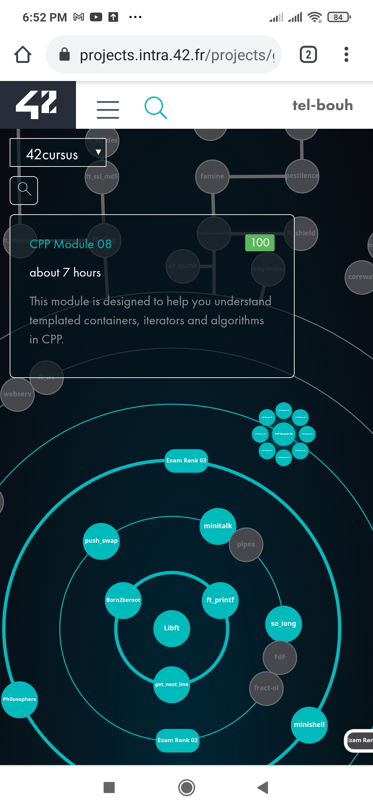

# Cpp Modules: the tenth pjoject in 42 cursus.

The aim of this project is the learn the basic concept behand OOP.

## Table of contents

- [ Cpp_modules: ](#the-tenth-pjoject-in-42-cursus.)
  - [Table of contents](#table-of-contents)
  - [Overview](#overview)
  - [The project](#the-project)
  - [Screenshot](#screenshot)

## Overview

The goal of these modules is to introduce you to Object-Oriented Programming.
This will be the starting point of your C++ journey. Many languages are recommended
to learn OOP. We decided to choose C++ since it’s derived from your old friend C.
Because this is a complex language, and in order to keep things simple, your code will
comply with the C++98 standard.

### The project

Each module is set of exericice of c++ concept.

### Screenshot

